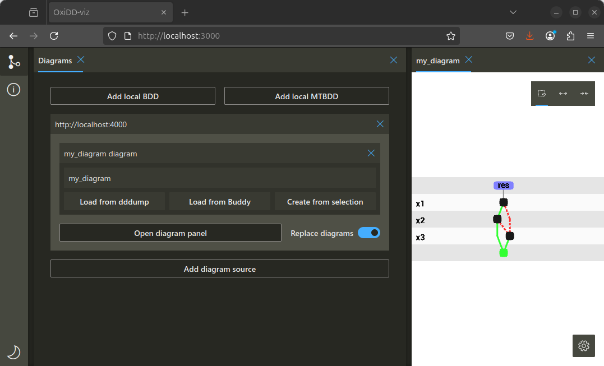

# OxiDD-vis

A decision diagram visualization tool. This tool is a work in progress, with many more possible features coming in the future, as well as code refactors that simplify adding support for new decision diagram types.


## Features

- **Several kinds of (reduced ordered) decision diagrams** are implemented, with more to come:
  - Binary decision diagrams (BDDs)
  - Multi-terminal BDDs (MTBDDs, aka ADDs)
- **Extensibility**: Due to OxiDD-vis’s composable design, one can implement new decision diagram visualizations without having to reimplement UI-components and layouting approaches.
- **Ease of use**: Diagrams can be visualized from OxiDD, and viewed directly in your browser at [oxidd.net/vis](https://oxidd.net/vis).
- **Scalability**: Grouping nodes together allows for the rendering and explorations of diagrams with millions of nodes.
- **Customisability**: Without alteration of any code, visualizations and their locations can be customised.

## Getting started

When either a BDD (no BCDD support), or a MTBDD is constructed in OxiDD, it can be visualized using the `visualize` function. See the below example:

```rust
// Create a manager for up to 2048 nodes, up to 1024 apply cache entries, and
// use 8 threads for the apply algorithms. In practice, you would choose higher
// capacities depending on the system resources.
let manager_ref = oxidd::bdd::new_manager(2048, 1024, 8);
let (x1, x2, x3) = manager_ref.with_manager_exclusive(|manager| {(
      BDDFunction::new_var(manager).unwrap(),
      BDDFunction::new_var(manager).unwrap(),
      BDDFunction::new_var(manager).unwrap(),
)});
// The APIs are designed such that out-of-memory situations can be handled
// gracefully. This is the reason for the `?` operator.
let res = x1.and(&x2)?.or(&x3)?;
println!("{}", res.satisfiable());

// The manager is required for visualization
manager_ref.with_manager_shared(|manager| {
    // We name the diagram (my_diagram), provide all variables, the functions to visualize (res), and the port to export on (defaults to 4000)
     visualize(
        manager,
        "my_diagram",
        &[&x1, &x2, &x3],
        Some(&["x1", "x2", "x3"]),
        &[&res],
        Some(&["res"]),
        Some(4000),
    )
    .expect("visualization failed");
});
```

In OxiDD-vis add a diagram source listening to `localhost:4000` and the diagram will automatically be read by the tool:



Alternatively, any tool can provide a BDD or MTBDD DDDMP file, which can be imported into OxiDD-vis manually.

## Project structure

OxiDD-vis is divided into two parts:

- The overall user interface, written in TypeScript using React, and
- The diagram rendering an interactions, written in Rust rendered with WebGL

All code specific to a given decision diagram type should be contained in Rust, where as the TypeScript code provides a general standardized experience in the tool regardless of the diagram type interacted with.

The Rust code is compiled to WASM, and presents its user interface in two ways:

- The diagram visualization itself, using WebGL
- Configuration of diagram options, using config objects written in TypeScript and React

The diagram visualization once again consists of two main parts:

- The diagram layouting
- The layout rendering

Finally, the graphs being visualized can be manipulated in several ways by the user. To support this, we abstract decision diagrams to [`GraphStructures`](./rust/src/types/util/graph_structure/graph_structure.rs) which do not have any semantics and whose only purpose is to be manipulated and eventually rendered.

### Config objects

Configurations are used by decision diagram visualizations to declare what options and interactions methods they have, which are specific to a given decision diagram type. This configuration can then be read and interacted with from TypeScript code to provide corresponding UI elements and present these interactions to the user. This allows us to use TypeScript and React to provide a good user interface, while keeping decision-diagram-type specific code contained to Rust.

The implementation of these configuration objects is spread over several locations:

- [Example usage in MTBDDs](./rust/src/types/mtbdd/mtbdd_drawer.rs#L518)
- [Implementation on Rust's side](./rust/src/configuration/types)
- [Implementation on TS's side](./typescript/src/state/configuration/types)
- [Rendering on TS's side](./typescript/src/UI/components/configuration)

### Layouting and Drawing

Layouting is done according to some [`LayoutRules`](./rust/src/types/util/drawing/layout_rules.rs) converting a [`GroupedGraphStructure`](./rust/src/types/util/graph_structure/grouped_graph_structure.rs) to a [`DiagramLayout`](./rust/src/types/util/drawing/diagram_layout.rs). Currently the only proper layout rules that are implemented is the [`LayeredLayout`](./rust/src/types/util/drawing/layouts/layered_layout.rs). This uses the Sugiyama framework to obtain a layered layout, and relies on 3 different components that can be provided:

- A layer ordering approach which specifies how to obtain a node ordering per layer
- A layer group sorting approach that specifies how to order nodes that span multiple layers
- A node positioning approach that specifies how to obtain exact coordinates for every node given an ordering

For node and group ordering, some simple heuristic options are provided, including the approach described by Sugiyama. For node positioning the Brandes-Kopf algorithm has been implemented. Decisision diagram types can choose or implement their own approaches for any of these aspects however, or use a different layout algorithm all-together.

Two more `LayoutRules` implementations are provided, which modify an existing `LayoutRules` implementation:

- The [`ToggleLayout`](./rust/src/types/util/drawing/layouts/toggle_layout.rs) which allows for switching between two provided layouts
- The [`TransitionLayout`](./rust/src/types/util/drawing/layouts/transition/transition_layout.rs) which provides transition data for consecutive renders of the same (or modified) graph

The `DiagramLayout` format includes transition information (which can be generated using the `TransitionLayout` higher-order `LayoutRules`), which are useful to visualize how user interactions affected the resulting graph visualization.

Finally, a given `DiagramLayout` can be visualized using a [`Renderer`](./rust/src/types/util/drawing/renderer.rs) such as the [`WebglRenderer`](./rust/src/types/util/drawing/renderers/webgl_renderer.rs) or the [`latex_renderer`](./rust/src/types/util/drawing/renderers/latex_renderer.rs)

### Graph manipulation

In order to provide easy to interpret visualizations, the actual decision diagram being visualized might need to be manipulated. It is for instance common to leave out one of the terminals from BDD visualizations to reduce clutter. `OxiDD-vis` provides two abstractions over decision diagram structures:

- [`GraphStructure`](./rust/src/types/util/graph_structure/graph_structure.rs) representing the node and edge structure of a decision diagram
- [`GroupedGraphStructure`](./rust/src/types/util/graph_structure/grouped_graph_structure.rs) which represents the node-group and edge structure of a decision diagram where nodes have been grouped together

Most manipulation will be done on a `GraphStructure` level, and then the [`GroupManager`](./rust/src/types/util/group_manager.rs) is used to allow the user to group nodes together resulting in a `GroupedGraphStructure`. A decision-diagram-type will then have to map node-groups of this `GroupedGraphStructure` to some of its visual information for rendering, such as the node-group text and color.

For graph manipulation, several adjusters are provided:

- [NodePresenceAdjuster](./rust/src/types/util/graph_structure/graph_manipulators/node_presence_adjuster.rs), to duplicate or hide nodes
- [PointerNodeAdjuster](./rust/src/types/util/graph_structure/graph_manipulators/pointer_node_adjuster.rs), to add label nodes to the graph
- [TerminalLevelAdjuster](./rust/src/types/util/graph_structure/graph_manipulators/terminal_level_adjuster.rs), to move terminals to the highest possible level
- [EdgeToAdjuster](./rust/src/types/util/graph_structure/graph_manipulators/edge_to_adjuster.rs), to remove edges from the graph

## Development

To run this application, you both have to build the rust-code, and run a web-development server. See the instructions below

### Rust

Install:

- Rust + cargo: https://www.rust-lang.org/tools/install (tested version: 1.79.0)
- Wasm-pack: https://rustwasm.github.io/wasm-pack/installer/ (tested version: 0.12.1)
<!-- - wasm2map: https://crates.io/crates/wasm2map (tested version 0.1.0) -->

Build code using (run from inside the rust directory):

```
wasm-pack build --dev
```

This includes more readable error messages on panic, for better runtime performance, build using:

```
wasm-pack build --release
```

### TypeScript

Install:

- https://nodejs.org/en (tested version: 18.15.0)

Install code dependencies (run from inside the typescript directory):

```
npm install
```

Note, do not use yarn for this install!! Yarn does not create a dynamic link.

Start development server (after having built the rust code):

```
npm run start
```

View the website at: http://localhost:3000/
